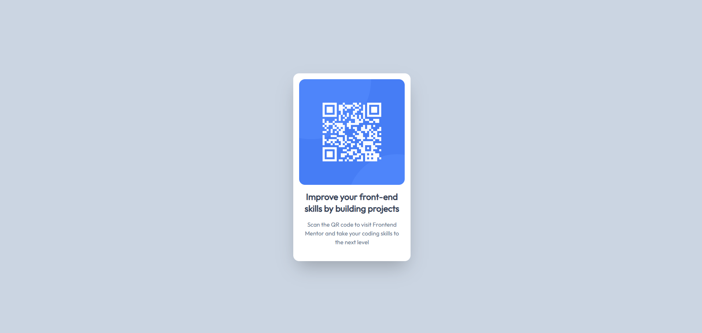
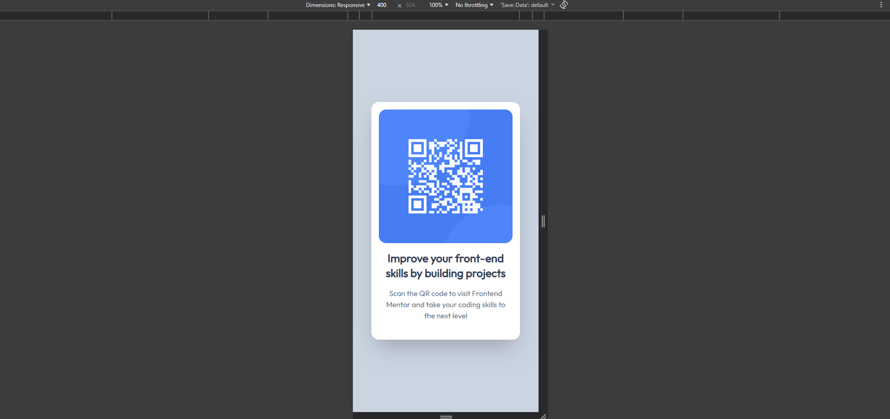

# Frontend Mentor - QR code component solution

This is a solution to the [QR code component challenge on Frontend Mentor](https://www.frontendmentor.io/challenges/qr-code-component-iux_sIO_H). Frontend Mentor challenges help you improve your coding skills by building realistic projects. 

## Table of contents

- [Overview](#overview)
  - [Screenshot](#screenshot)
  - [Links](#links)
- [My process](#my-process)
  - [Built with](#built-with)
  - [What I learned](#what-i-learned)
  - [Continued development](#continued-development)
  - [Useful resources](#useful-resources)

**Note: Delete this note and update the table of contents based on what sections you keep.**

## Overview

### Screenshot

### Links

- Solution URL: [Static Pages](https://github.com/NeutralP/static-pages)
- Live Site URL: [Live site URL](https://frontendprac.neutralp.com/challenges/qr-code-component/)

## My process
- Needed to find Static Page Framework that I can use to learn Tailwind
- Tried Tanstack Start (SPA), gave up
- Tried Next (for some funny reason), gave up
- Tried Astro, did Blog Post tutorial and did the challenge

### Built with

- Semantic HTML5 markup
- Astro
- Tailwind
- Flexbox

### What I learned

That setting up Prettier is a pain in the ass.
Note to future devs: extension for Prettier in VSCode Marketplace DO NOT use the Legacy one (one that is downloaded more). It doesn't work w/ Astro

Otherwise, you can see my `.prettierrc` for simple set up.

### Continued development

I'll try refactor this blog project tutorial into a showcase of all solution for Frontend Mentor Challenges instead. Right now I just had the solution set up on 1 random page,

### Useful resources

Read the docs. If you don't understand the docs, use chat gpt :smile:
